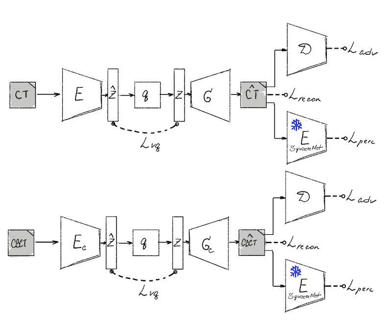
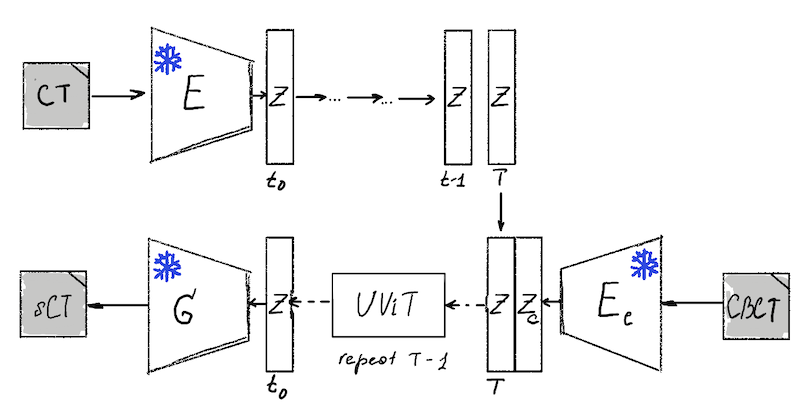

# SynthRAD 2025 Challenge Solution: Task 2 - CBCT-to-CT translation

[Task description](https://synthrad2025.grand-challenge.org)
**VarDiFFormer**: CBCT to CT Translation with variational diffusion with UViT denoising;

> **⚠️ Notice**: This solution is designed for **2D data only**. The 3D SynthRAD challenge dataset must be preprocessed to extract 2D slices before training.

## Method

This repository implements a two-stage approach for CBCT-to-CT translation using Vector Quantized Variational Autoencoders (VQVAE) and variational diffusion model (Kingma, 2021)[1] with ViT denoising (Bao, 2023)[2].

### Stage 1: Separate VQVAE Training

We train separate VQVAE models for CT and CBCT modalities to learn compact quantized latent representations:

- **CT VQVAE**: Learns to encode/decode CT images into a discrete latent space;
- **CBCT VQVAE**: Learns to encode/decode CBCT images into a discrete latent space;
- **Training**: Uses adversarial loss, perceptual loss, and L1 reconstruction loss;
- **Architecture**: 2D convolutional encoder-decoder with vector quantization bottleneck.



### Stage 2: Conditional Diffusion in Latent Space

The diffusion stage operates in the quantized latent space using a U-shaped Vision Transformer (UViT):

- **Input**: Concatenated CBCT and CT latent representations from Stage 1 encoders;
- **Architecture**: UViT transformer with patch-based processing and skip connections;
- **Conditioning**: CBCT latent features guide the generation of CT latent codes;
- **Training**: Variational Diffusion Model (VDM) with **learnable** noise scheduling;
- **Output**: Diffusion denoising implicit model (DDIM) sampling.



## Results

Our best performing model achieved the following metrics on the test set:

- **PSNR**: 25.95 dB
- **SSIM**: 0.867
- **MSE**: 0.0034
- **FID**: 1434.5

### Qualitative Results

*From left to right: Original CBCT, Generated CT, Ground Truth CT, Absolute Difference*


## Quick Start

```bash
# Clone repository
git clone https://github.com/relyativist/cbct2ct-diffusion.git

cd cbct2ct-diffusion

# Set up environment
pip install -r requirements.txt

# Run data visualization check 
python check_dataset.py -p configs/diffusion_config.yaml
```
Code will output the visualizations to the directory set in `vis_dir: "./debug"`

## Data Preprocessing

**Important**: Before training the models, you must first convert the 3D SynthRAD challenge dataset to 2D slices using the provided preprocessing script.

### Convert 3D to 2D Slices

The SynthRAD challenge provides 3D volumes, but this solution works with 2D slices. Use the `3d_2d.py` script to extract the middle axial slice from each 3D volume:

```bash
# Extract 2D slices from the SynthRAD dataset
python 3d_2d.py --input /path/to/synthrad/dataset --output /path/to/2d/dataset --visualize
```

**Parameters:**
- `--input`: Path to the original 3D SynthRAD dataset
- `--output`: Path where 2D slices will be saved
- `--visualize`: (Optional) Generate visualization of extracted slices
- `--num-examples`: (Optional) Number of examples to show in visualization (default: 3)

This script will:
- Extract the middle axial slice from each 3D MHA file
- Maintain the original directory structure
- Save each slice as a 2D MHA file
- Optionally create visualizations to verify the extraction

## Training

### Configuration

Before running the training scripts, you need to configure the settings:

- **Stage 1 (VQVAE)**: Edit `configs/ae_config.yaml` to set data paths, modality selection (`["ct"]` or `["cbct"]`), and training parameters
- **Stage 2 (Diffusion)**: Edit `configs/diffusion_config.yaml` to set VQVAE checkpoint paths and diffusion parameters

### Stage 1: VQVAE Training

Train separate VQVAE models for CT and CBCT modalities:

```bash
# Train CT VQVAE
python train_vqgan_2d.py -c configs/ae_config.yaml

# Train CBCT VQVAE (modify config to set modality: ["cbct"])
python train_vqgan_2d.py -c configs/ae_config.yaml
```

### Stage 2: Diffusion Training

After Stage 1 models are trained, train the conditional diffusion model:

```bash
# Train diffusion model (requires pre-trained VQVAE checkpoints)
python train_vdm_uvit_2d.py -c configs/diffusion_config.yaml
```

**Note**: Update the checkpoint paths in `configs/diffusion_config.yaml` to point to your trained VQVAE models from Stage 1.

## Data Structure

Expected dataset structure (after preprocessing with `3d_2d.py`):
```
data/
├── AB/
│    └── subject_id/
│       ├── cbct.mha  # 2D slice extracted from 3D volume
│       ├── ct.mha    # 2D slice extracted from 3D volume
│       └── mask.mha  # 2D slice extracted from 3D volume
├── HN/
│    └── ...
└── TH/
```

## References

[1] Kingma, D. P., Salimans, T., Poole, B., & Ho, J. (2021). Variational Diffusion Models. *Advances in Neural Information Processing Systems*, 34. arXiv:2107.00630.

[2] Bao, F., Nie, S., Xue, K., Cao, Y., Li, C., Su, H., & Zhu, J. (2023). All are Worth Words: A ViT Backbone for Diffusion Models. *Proceedings of the IEEE/CVF Conference on Computer Vision and Pattern Recognition (CVPR)*. arXiv:2209.12152.
